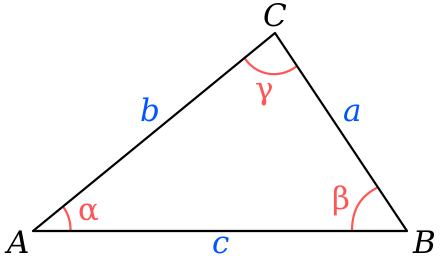
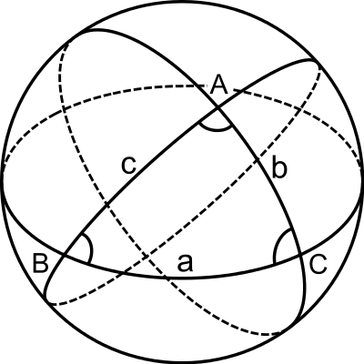
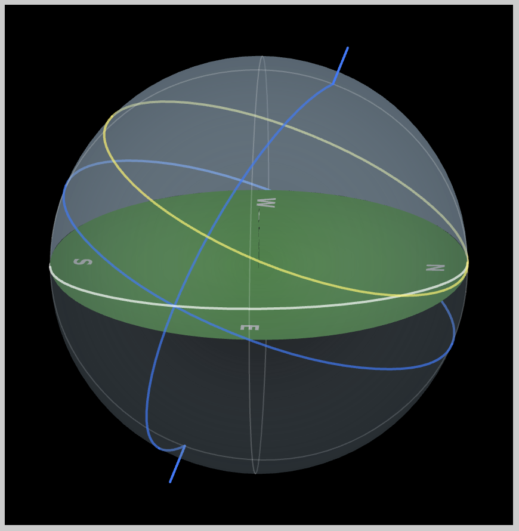
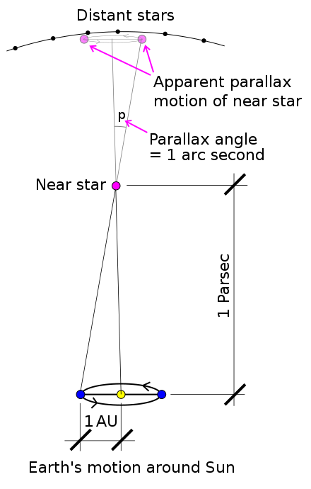
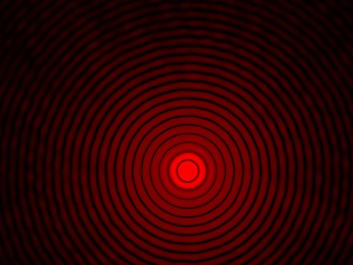
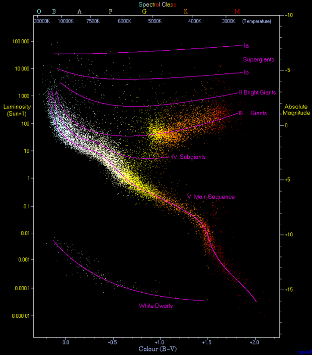
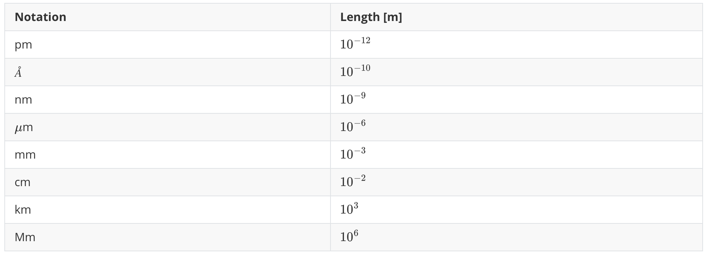

This is a cheat sheet for USAAAO

# Orbital Dynamics

## Newton Gravity Law

$$
F_g = \frac{G M m}{r^2}
$$

This is known as the *Inversed-Squared* law of gravity. $G$ is the Gravitational Constant.

### Gravity Potential Energy: Point Mass

Assuming the potential energy at infinity is *zero*, by integrating the gravity law, we have the potential energy at $R$:

$$
U=\int_\infty^{R} \frac{GMm}{r^2}dr=-\frac{G M m}{R}
$$

Therefore the *Sun* can be visualized as a *Gravitational Well* , in which the deeper you get, the less energy you have.

### Gravity Potential Energy: Uniform Ball

A ball with mass $M$ and radius $R$, assuming uniform density:

$$
\rho = \frac{M}{\frac{4}{3}\pi R^3}
$$

The potential energy is:

$$
\begin{aligned}
U=\int_0^RdU & =\int_0^R -\frac{G M(r) dm}{r} \\
 &= \int_0^R -\frac{G \cdot \frac{4}{3}\pi r^3 \rho \cdot 4\pi r^2 dr  \rho}{r}\\
 &= -\frac{3 G M^2}{R^6} \int_0^R r^4 dr\\
 &= -\frac{3}{5} \frac{GM^2}{R}
\end{aligned}
$$

Together with *viral theorem*: $\langle K\rangle = -\frac{1}{2}\langle U \rangle$, one can link the observational properties (velocities->kinetic energy) to its mass

## Conservation of Momentum

**Examples:** 

Without the effects of *force*, the momentum of the system is conserved:

$$
\vec P = \sum_{m} \vec p = \sum_m m \vec v = const
$$

## Conservation of Angular Momentum

**Examples:** 

Without the effects of *torque*, the angular momentum of the system (referenced at a give point) is conserved

$$
\vec L = \sum_m \vec l = \sum_m \vec r\times m \vec v = const
$$

## Conservation of Energy

The total energy: Kinetic+Potential is **conserved** for planets:

$$
E = K+U = \frac{1}{2}mv^2-\frac{GMm}{r}
$$

For a elipse orbit with semi-major axis $a$: (Derivation: Conservation of energy at aphelia and perihelia)

$$
E = -\frac{GMm}{2a} = \frac{1}{2}mv^2-\frac{GMm}{r}
$$

### Orbital Energy

$E = -\frac{GMm}{2a}$ is known as the *orbital energy*. One immediately notices three properties:

- $E$ is *negative* for elipse ($a>0$), *zero* for parabola ($a=\infty$), *positive* for hyperbola ($a<0$)
- Increase in *orbital energy* will increase $a$ until it becomes a parabola, or even hyperbola
- A meteorite is *trapped* when $E<0$, it *escapes* when $E\ge0$.

### Vis-Viva Equation

Due to the conservation of orbital energy, one calculate velocity based on distance $r$:

$$
v=\sqrt{GM\left(\frac{2}{r}-\frac{1}{a}\right)}
$$

This is known as the *vis-viva* equation. The *escape* velocity is:

$$
v_{excape}=\sqrt{\frac{2GM}{r}}
$$

**Examples:** 2021-Q15

### Viral Theorem

In statistical mechanics, people are often interested in the averaged behavior of an ensemble of particles, one of the most important results is the *viral theorem*:

$$
\langle K\rangle = -\frac{1}{2}\langle U \rangle
$$

And therefore the total energy:

$$
\langle E \rangle = \langle K\rangle + \langle U \rangle = -\langle K \rangle = \frac{1}{2}\langle U\rangle
$$

**Examples:** 2021-Q9

## Kepler's Law

**Examples:** 2023-Q21

### First Law

*The orbit of a planet is an ellipse with the Sun at one of the two foci.*

### Second Law

*line segment joining a planet and the Sun sweeps out equal areas during equal intervals of time.*

This is effectively the *Conservation of Angular Momentum*, because:

- For a small object orbiting a central star, the *Gravity force* is point towards the star, therefore the change in augular momentum:

$$
d \vec L= \vec r \times \vec F_g = 0
$$

And the angular momentum:

$$
\vec L = \vec r \times m \vec v
$$

is conserved.

- Constant $\vec L$ is identical to * sweeps out equal areas during equal intervals of time*

$$
\vec r \times m \vec v dt  \propto \vec r \times \vec v dt
$$

is the small change in the area

### Third Law

*The square of a planet's orbital period is proportional to the cube of the length of the semi-major axis of its orbit.*

Simple derivation can be inferred from circular orbit, where the **centrifugal force balances the gravity force** ($v\omega=v^2/r=\omega^2r$ is know as the **centrifugal acceleration**):

$$
\frac{G M m}{a^2} = m \frac{v^2}{a}=m \omega^2 a  = m \left(\frac{2\pi}{T}\right)^2 a \\
\frac{G M}{4\pi^2} = \frac{a^3}{T^2}
$$

## Sidereal Day and Solar Day

**Examples:** 2020-Q12; 

We denote sidereal day as $t_{sid}$ and Solar Day as $t_{sol}$, we have:

$$
t_{sid} = \frac{2\pi}{\omega_0}
$$

$$
t_{sol} = \frac{2\pi}{\omega_0-\omega_1 \cos\theta}
$$

where $\omega_0$ is the angular velocity of the planet's rotation, and $\omega_1$ is the angular velocity of orbital revolution, $\theta$ is the tilt angle.

# Celestial Coordinates and Time

**Examples:** 2023-Q1|17|18; 2022-Q24|25|28|30

## Trigonometry

### Length of Arc

Circumfurence: $2\pi r$

Length of Arc: $\theta r$

### Law of Cosine

$$
\begin{aligned}
a^2&=b^2+c^2-2bc\cos\alpha\\
b^2&=a^2+c^2-2ac\cos\beta\\
c^2&=a^2+b^2-2bc\cos\gamma
\end{aligned}
$$

Derivation:
$$
\overrightarrow{BC}=\overrightarrow{AC}-\overrightarrow{AB}
$$

$$
\begin{aligned}
|\overrightarrow{BC}|^2&=|\overrightarrow{AC}-\overrightarrow{AB}|^2\\
&=|\overrightarrow{AC}|^2+|\overrightarrow{AB}|^2-2\overrightarrow{AC}\cdot\overrightarrow{AB}\\
a^2&=b^2+c^2-2bc\cos\alpha
\end{aligned}
$$

### Law of Sine

$$
\frac{a}{\sin\alpha}=\frac{b}{\sin\beta}=\frac{c}{\sin\gamma}
$$

## Spherical Trigonometry

### Spherical Law of Cosine

$$
\begin{aligned}
& \cos a=\cos b \cos c+\sin b \sin c \cos A \\
& \cos b=\cos c \cos a+\sin c \sin a \cos B \\
& \cos c=\cos a \cos b+\sin a \sin b \cos C
\end{aligned}
$$

### Spherical Law of Sine

$$
\frac{\sin A}{\sin a}=\frac{\sin B}{\sin b}=\frac{\sin C}{\sin c}
$$

### Area of the Spherical Triangle

$$
Area\ of\ triangle =A+B+C-\pi\\
Total\ Area=4\pi
$$

## Celestial Coordinate

### Circumpolar 

$$
90-\delta<\lambda
$$

$\lambda$ is latitude, $\delta$ is declination

# Telescope & Star Magnitudes

## Parallax

**Examples:** 

One *parsec*$\approx 3.26\ ly$  is the parallax of the distant star from a triangle of 1AU and 1 arcsec

Some confusing notations:

- $mac$: micro-arcsec = $10^{-3} arcsec$
- $Mpc$: Million-parsec = $10^{6} pc$ 

## The Airy Spot

**Examples:** 2022-Q6

Due to the diffraction of light, the *best-focused spot* of light has a limited angular size. 

$$
\sin \theta \approx \theta \approx 1.22 \frac{\lambda}{d}
$$

where $\lambda$ is the light wavelength, $d$ is the diameter of the lens. To **differentiate** two light source, they have to be $\theta$ away from each other.

## Telescope Parameters

**Examples:** 2021-Q13, 2023-Q2|Q24

###  $f$ number (focal ratio)

The focal ratio is the ratio between the focal length $f$ and the diameter of the aperture $d$:

$$
N = \frac{f}{d}
$$

This number is usually denoted as $f/N$. 

For example, $f/2$ means $f = 2d$, the *larger the number, the worse the telescope*.

### Magnification

The magnification:

$$
m=f_o/f_e
$$

is the ratio between the focal length of $objective$ and $eyepiece$ lens.

## The Apparent and Absolute Magnitude

**Examples:** 2023-Q2|13; 2022-Q8|18|20; 2021-Q22|23; 2020-Q13; 2019-Q13, 2018-Q13|21

### Magnitude and Flux

The ultimate physical carrier of light is the flux of photons (or electric-magnetic field), which follows the *inversed-squared law*. Magnitude is a *representation* of the *relative* amount of flux. The definition is that:

> Five unit of *magnitude* = 100 difference in $flux$
> 
> $$
> 100^{\frac{m_1-m_2}{5}} = \frac{F_2}{F_1}
> $$

This can be rewritten in terms of distance (for same type of star):

$$
10^{\frac{m_1-m_2}{5}} = \frac{d_1}{d_2}
$$

And in log10 in terms of distance:

$$
m_1 - m_2 = 5 \log_{10}d_1 - 5 \log_{10} d_2
$$

### Absolute Magnitude $M$

The apparent magnitude of a star measured at $10 pc$  ($\log_{10}(10pc)=1$):

$$
M = m-5\log_{10}(d_{pc})+5
$$

### Extinction

Due to the existence of dust, the light can dim:

$$
m-M=5 * \log (d)-5+a_V * d
$$

Where $a_{V}$ is the interstellar extinction in the unit of $mag/pc$ or $mag/kpc$

**Examples:** 2021-Q23, 2019-Q13

# Special Relativity, Hubble's Law & Red Shift

## Hertzsprung–Russell diagram

## Special Relativity and Cosmology

If the velocity is comparable to the speed of light $c$, the relativity effects can not be ignored.

### Mass-Energy Equation

**Examples:** 2023-Q11, 2022-Q12|15, 2021-Q20, 2020-Q15

The mass and energy is equivalent:

$$
E=mc^2
$$

The loss of mass is identical to the loss of energy. This is the ultimate source of energy in the universe: *Fusion in the stars*.

### Lorentz Coefficient

$$
\gamma = \frac{1}{\sqrt{1-v^2/c^2}}
$$

For a moving body, the time flow is slower "*Time dilation*": ($S'$ is the moving frame)

$$
\Delta t'=\gamma \Delta t
$$

The "*length contraction*":

$$
\Delta x'=\frac{\Delta x}{\gamma}
$$

**Examples:** 2023-Q15, 

## Hubble's Law & Red Shift

**Examples:** 2023-Q27; 2022-Q29;2021-Q8|12|26

The universe is constantly expanding with a coefficient $H_0=70 km/s /Mpc$, the expanding speed is:

$$
v=H_0 D
$$

The resulting "red-shift velocity" is **defined** to be:

$$
v_{rs}=c z
$$

where $z$ is the red shift. In low velocity case, this can be related to the real red-shift in observed wavelength using the  *Fizeau-Doppler Formula*:

$$
z=\frac{\lambda_{\mathrm{o}}}{\lambda_{\mathrm{e}}}-1=\sqrt{\frac{1+\frac{v}{c}}{1-\frac{v}{c}}}-1 \approx \frac{v}{c}
$$

where $\lambda_o$ and $\lambda_e$ is the observed and emitted wavelength. Since the speed of light is constant, this can also be used to calculate the change in frequency:

$$
\frac{\nu_e}{\nu_o} =\sqrt{\frac{1+\frac{v}{c}}{1-\frac{v}{c}}}
$$

### Critical Density of the Universe

Replace the escape velocity with the speed of the light from Hubble's expansion:

$$
c=H_0 r=\sqrt{\frac{2GM}{r}}
$$

We have:

$$
\rho = \frac{M}{\frac{4}{3}\pi r^3} = \frac{3 H_0^2}{8\pi G} \simeq9.22 \times 10^{-27} kg \cdot m^{-3}
$$

# MISC

### Signal to Noise Ratio

Proportional to $\sqrt{N}$ , where $N$ is the number of measurements or exposure time

**Examples:** 2022-Q27

### Energy of E&M Wave

Poynting Flux: 
$$
\vec S = \vec E\times \vec B
$$
is *independent* of frequency

# Constants and Notations

## Constants 

1. The absolute magnitude of the Sun: 4.83
2. Age of the Universe: 13.4 Billion years
3. Visible wavelength: 310 nm (ultraviolet) - 1100 nm (infrared)

## Notations
1. Length: 

   

